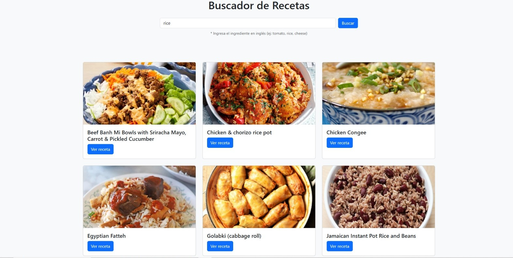

# 🍳 Buscador de Recetas – Gourmet Go



Aplicación web que permite buscar recetas utilizando una **API externa**, mostrando resultados dinámicos según el ingrediente o plato ingresado por el usuario.

---

## 📌 Descripción

El **Buscador de Recetas** es una aplicación web que consume una API pública para obtener recetas de cocina.

El usuario puede escribir el nombre de un ingrediente o plato en el buscador y la aplicación mostrará diferentes recetas disponibles con su imagen y un enlace para ver más detalles.

Este proyecto demuestra el uso de:

* Consumo de **APIs REST**
* Manipulación del **DOM con JavaScript**
* Renderizado dinámico de contenido en el navegador

---

## 🚀 Demo en Vivo

🔗 https://buscador-recetas-liard.vercel.app

---

## 🛠️ Tecnologías Utilizadas

* HTML5
* CSS3
* JavaScript
* Fetch API
* Git
* GitHub

---

## ⚙️ Instalación

1. Clonar el repositorio

```id="3hds8y"
git clone https://github.com/aberriosdev/buscador-recetas.git
```

2. Entrar al proyecto

```id="bnczwi"
cd buscador-recetas
```

3. Abrir el archivo principal

```id="r1er4l"
index.html
```

4. Ejecutar el proyecto abriendo el archivo en tu navegador.

---


## 👩‍💻 Autora

**Paulina Berríos**

GitHub
https://github.com/aberriosdev


